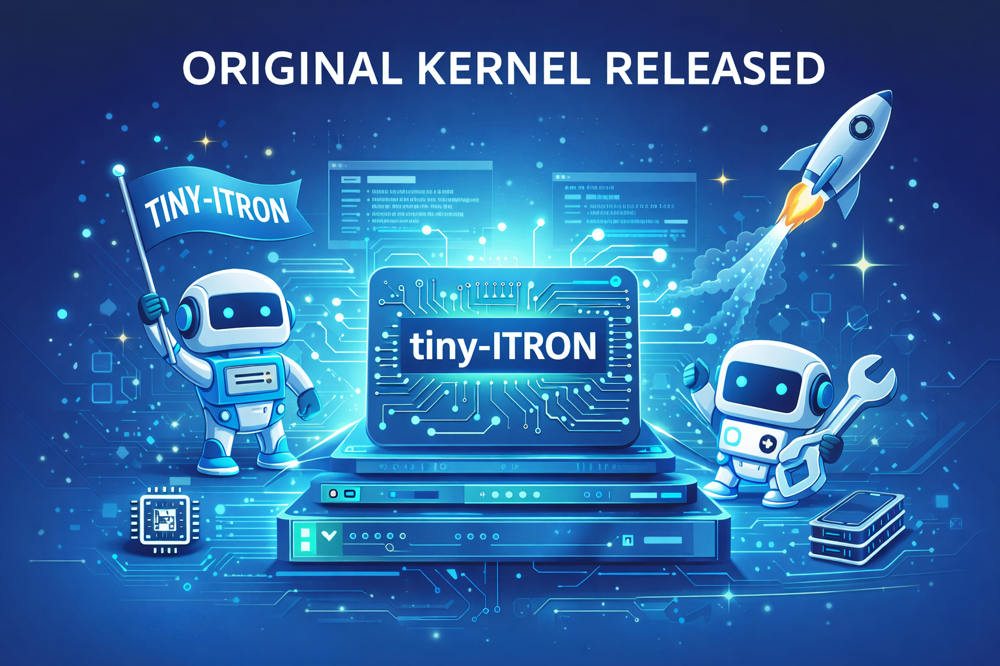

# tiny-itron

**Japanese version: [README-ja.md](README-ja.md)**

An educational bare-metal RTOS (real-time operating system) kernel for i386 (x86/IA-32) based on the [Micro ITRON 4.0 (μITRON)](https://www.ertl.jp/ITRON/SPEC/mitron4-e.html) specification. Features SMP (2 CPUs), preemptive multitasking, and full interrupt handling with context switching — all running on QEMU.
Originally created around 2000 as a hobby project; several changes were made to publish the kernel on GitHub.
It's a toy OS kernel, but you can try it immediately in a QEMU virtual environment. If you're looking for a textbook-style kernel study, this project may not have much to offer. However, if you enjoy programming and want to learn how boot sectors, GDT/IDT setup, and task scheduling actually work at the hardware level, we hope this can be of help.
AI was used to create the documentation. We believe it was generated mostly correctly, but there may be places where the explanation is insufficient and slipped through review. In that case, try asking your own AI to analyze the source code directly — that will likely give you the correct answer.


## Purpose of This Project

Most people learn how operating systems work from textbooks.
This project exists to **learn by playing with and running actual kernel code**.

tiny-itron borrows the API style of Micro ITRON 4.0 — tasks, semaphores, event flags, and so on —
but does not aim to faithfully or completely implement the specification.
Many ITRON syscalls remain as stubs, and the internal architecture
freely deviates from the specification in favor of simplicity.
This is a toy kernel — and that is precisely its advantage.

Being small (approximately 8,000 lines of C and assembly combined) means you can
hold the entire system in your head. There is no abstraction layer hiding the hardware.
Trace a syscall from user space to the kernel, and every instruction is visible.
Add a single `printk` line to the scheduler and reboot — you'll see the result in seconds.

This project focuses on two themes that textbooks explain in theory
but rarely let you **get your hands on**:

- **The boot process** — from the BIOS loading the 512-byte boot sector,
  through real mode → protected mode transition, GDT/IDT/TSS setup,
  paging, and PIC/APIC initialization, all the way to the first user task
  starting in Ring 3. Every step exists in the source code and is documented.

- **Bare-metal multitasking** — how the `SAVE_ALL`/`RESTORE_ALL` macros
  save and restore 9 registers on per-task kernel stacks to switch tasks,
  how `intr_leave` performs a context switch by simply swapping ESP,
  how two CPUs coordinate via spinlocks,
  and how a keyboard interrupt preempts a running task.
  All of this can be observed in real time with GDB.

The goal is not production quality. The goal is that every constant has a reason,
every register save has a comment explaining *why*,
and every path from user space to hardware can be traced
with nothing but `grep` and `gdb`.

## Screen Output

When the kernel runs, a VGA text mode screen is displayed in QEMU:

```
  TinyITRON/386 SMP (2 CPU)                            [Ctrl+C to quit]
  ============================================================================

    Timer         tick =         12345

  [CPU0] Task1 |  #       142     mbf: hello world

  [CPU0] Task3 /  #        71     [LOCK]---+
                                            \
                                             +---> Shared (sem 1)    #       38

  [CPU1] Task2 -  #       284     [BUSY]---+

  [CPU1] Task4    > hello world_


                      .---------.             .---------.
                      |  CPU 0  |             |  CPU 1  |
                      | Task1,3 |---[ BKL ]---| Task2,4 |
                      |  Idle5  |             |  Idle6  |
                      '---------'             '---------'
                           \                     /
                            '--- Shared Memory --'

  Copyright (c) 2000-2026 t-ishii66. All rights reserved.
```

- **Task 1** and **Task 3** alternate on CPU 0 via `wup_tsk`/`slp_tsk`
- **Task 2** runs continuously on CPU 1
- **Task 3** (CPU 0) and **Task 2** (CPU 1) compete for a binary semaphore
  to access a shared counter — LOCK/BUSY status is displayed in real time
- **Task 4** has the highest priority and echoes keyboard input, preempting Task 2.
  On Enter, it sends a line string to Task 1 via a message buffer (MBF)
- **Timer tick** is driven by the PIT (IRQ0) on CPU 0
- The bottom of the screen shows an **SMP architecture diagram**: the 2-CPU configuration,
  BKL (Big Kernel Lock), and shared memory bus

## Prerequisites

Verified on Ubuntu 24.04 LTS (amd64).

```bash
# Build tools (GCC, Make) + 32-bit support
sudo apt install build-essential gcc-multilib

# Emulator
sudo apt install qemu-system-x86

# Debugger (optional)
sudo apt install gdb
```

See [docs/en/build-system.md](docs/en/build-system.md) for details.

## Build and Run

```bash
# Build
make

# Run in QEMU (2 CPUs)
./run.sh          # curses mode (VGA text on terminal, Ctrl+C to quit)
./run.sh -g       # GTK window mode (Ctrl+Alt+G to release grab)
./run.sh -G       # GDB mode (waits for connection on port 1234)

# Clean build
make clean && make
```

## GDB Debugging

```bash
# Terminal 1
./run.sh -G

# Terminal 2
gdb i386/_kernel_dbg
(gdb) set architecture i386
(gdb) directory i386 kernel lib
(gdb) target remote :1234
(gdb) break first_task
(gdb) continue
(gdb) info threads            # Both CPUs are visible
(gdb) p task_count[1]         # Task 1 run count
(gdb) p shared_count          # Semaphore-protected shared counter
```

See [docs/en/gdb-debugging.md](docs/en/gdb-debugging.md) for details.

## Architecture

### Hardware Initialization Flow

The kernel initializes the following hardware features in order during boot:

```
BIOS
  ↓  Load kernel from floppy via INT 13h
Boot sector (boot.s)
  ↓  Real mode → protected mode transition
GDT / IDT / TSS (start.s, interrupt.c, tss.c)
  ↓  Segments, interrupt gates, task state segment
PIC i8259 (interrupt.c)
  ↓  IRQ routing: all external IRQs delivered to CPU 0 only
Local APIC (smp.c)
  ↓  CPU identification (APIC ID), per-CPU timer, EOI
Paging (page.c)
  ↓  Identity mapping, User/Supervisor access control
Kernel startup → first user task (Ring 3)
```

### Privilege Model

| Ring | CS     | DS     | SS     | Role             |
|------|--------|--------|--------|------------------|
| 0    | 0x20   | 0x28   | 0x30   | Kernel           |
| 3    | 0x5B   | 0x63   | 0x6B   | User tasks       |

### SMP Design

- **2 CPUs**: BSP (CPU 0) + AP (CPU 1), identified by Local APIC ID
- **AP startup**: INIT IPI + SIPI sequence, AP re-enters protected mode
- **Timers**: PIT (IRQ0, CPU 0 only) + Local APIC timer (both CPUs)
- **Spinlocks**: `xchgl`-based (usable from Ring 3, no `cli`/`sti` needed)
- **CPU affinity**: each task is pinned to a CPU, scheduler filters by affinity
- **No I/O APIC**: intentional simplification. PIC handles all external IRQs

### Syscall Path

```
User task           Ring 3              Ring 0
──────────          ──────              ──────
slp_tsk()
  -> syscall(0x11)
    -> int $0x99  ----[gate]---->  intr_syscall
                                    -> SAVE_ALL (9 regs → per-task kernel stack)
                                    -> intr_enter (k_nest++)
                                    -> c_intr_syscall(pt_regs*)
                                      -> itron_syscall
                                        -> syscall_entry[0x11] = sys_slp_tsk
                                    -> regs->eax = return value
                                    -> intr_leave (k_nest--, task switch decision)
                                    -> RESTORE_ALL (9 regs pop)
                                    -> iret  ----[gate]----> return to user
```

See [docs/en/syscall.md](docs/en/syscall.md) for details.

### Context Switch

```
SAVE_ALL:    Executed at the beginning of every interrupt/syscall
             Push EAX,ECX,EDX,EBX,EBP,ESI,EDI,DS,ES onto per-task kernel stack

intr_leave:  Executed only when returning from the outermost interrupt (k_nest == 0)
             current_proc[cpu]->kern_esp = ESP   (save current task's ESP)
             sched_next_tsk_check(cpu)           (task switch decision)
             ESP = current_proc[cpu]->kern_esp   (load new task's ESP)
             tss_update_esp0()                   (update TSS.esp0 for new task)

RESTORE_ALL: Pop ES,DS,EDI,ESI,EBP,EBX,EDX,ECX,EAX
             → Restored from the new task's kernel stack, so the task switches

iret:        Atomically restore CS:EIP, SS:ESP, EFLAGS → new task begins executing in Ring 3
```

See [docs/en/context-switch.md](docs/en/context-switch.md) for details.

## Source Structure

```
i386/           Architecture-dependent code
  boot/           Boot sector (boot.s) and loader tables
  start.s         Real mode → protected mode transition
  main.c          Kernel entry point, initialization sequence
  intr.s          SAVE_ALL/RESTORE_ALL, all interrupt/exception/syscall entries
  klib.s          start_first/second_task, I/O port helpers, spinlocks
  proc.c          Task proc_t management, fake pt_regs frame construction, CPU affinity
  interrupt.c     IDT setup, IRQ/exception/syscall handler registration
  page.c          Page directory/table setup (identity mapping, U/S access control)
  smp.c           AP startup (INIT/SIPI), Local APIC timer
  syscall.c       c_intr_syscall (read args from pt_regs*, write back return value)
  video.c         VGA text mode driver (0xB8000)
  keyboard.c      PS/2 keyboard driver, IRQ1
  timer.c         PIT (8254) initialization
  tss.c           TSS initialization, dynamic esp0 update

kernel/         Architecture-independent ITRON kernel
  syscall.c       itron_syscall dispatcher
  syscallP.h      syscall_entry[] dispatch table
  sys_tsk.c       Task management (cre/act/slp/wup/ter_tsk, ...)
  sys_sem.c       Semaphores (cre/sig/wai/pol_sem)
  sys_flg.c       Event flags
  sys_dtq.c       Data queues (ring buffer)
  sys_mbf.c       Message buffers
  sys_mbx.c       Mailboxes
  sys_exd.c       Extended syscalls (VGA, keyboard, stack allocation)
  sched.c         Priority-based scheduler, ready queue, timeout queue
  pool.c          Memory pool (stack / user memory / kernel memory)
  user.c          Demo user tasks (first_task, second_task, usr_main, kbd_task)

lib/            User-space library (linked into .user_text)
  lib_tsk.c       Task management wrappers (cre_tsk, slp_tsk, ...)
  lib_sem.c       Semaphore/flag/DTQ/mailbox wrappers
  lib_mbf.c       Message buffer wrappers
  lib_exd.c       Extended syscall wrappers (print_at, set_key_task, ...)

include/        Shared headers
  itron.h         ITRON type definitions, error codes, TFN_* function codes
  config.h        Kernel limits (MAX_TSKID=16, TMAX_TPRI=16, ...)
  exd.h           Non-ITRON extended API prototypes

docs/
  ja/             Documentation (Japanese)
  en/             Documentation (English)
```

## Documentation

Available in Japanese (`docs/ja/`) and English (`docs/en/`). `docs/ja/refs/` also contains per-file detailed references.

| Document | Contents |
|---|---|
| [system-overview.md](docs/en/system-overview.md) | Architecture overview — read this first for the big picture |
| [i386-architecture.md](docs/en/i386-architecture.md) | GDT, IDT, TSS, PIC, paging — i386 hardware fundamentals |
| [build-system.md](docs/en/build-system.md) | Build process, linker scripts, environment setup |
| [boot-sector.md](docs/en/boot-sector.md) | Boot sector and floppy loading |
| [memory-map.md](docs/en/memory-map.md) | Physical memory layout |
| [context-switch.md](docs/en/context-switch.md) | SAVE_ALL/RESTORE_ALL and context switch mechanics |
| [syscall.md](docs/en/syscall.md) | Syscall processing flow (user → kernel → return) |
| [timer-interrupt.md](docs/en/timer-interrupt.md) | Timer interrupts and SAVE_ALL/RESTORE_ALL in detail |
| [smp-basics.md](docs/en/smp-basics.md) | SMP startup, APIC configuration, per-CPU data |
| [itron-guide.md](docs/en/itron-guide.md) | ITRON API introduction |
| [keyboard.md](docs/en/keyboard.md) | Keyboard driver and DTQ/MBF pipeline |
| [timeout.md](docs/en/timeout.md) | Timeout mechanism (tslp_tsk, trcv_dtq, twai_sem) |
| [vga-text-mode.md](docs/en/vga-text-mode.md) | VGA text mode programming |
| [gdb-debugging.md](docs/en/gdb-debugging.md) | GDB debugging guide |
| [source-guide.md](docs/en/source-guide.md) | Source file reference |
| [docs/ja/refs/](docs/ja/refs/) | Per-file detailed reference (Japanese only) |

## ITRON Syscall Status

| Category          | Implemented                                            | Status        |
|-------------------|--------------------------------------------------------|---------------|
| Task management   | cre_tsk, act_tsk, slp_tsk, wup_tsk, ter_tsk, chg_pri | Verified      |
| Task management   | tslp_tsk, ext_tsk, exd_tsk, sus_tsk                   | Implemented   |
| Semaphores        | cre_sem, sig_sem, wai_sem, pol_sem, twai_sem           | Verified      |
| Event flags       | cre_flg, set_flg, wai_flg, pol_flg                    | Implemented   |
| Data queues       | cre_dtq, snd_dtq, psnd_dtq, ipsnd_dtq, rcv_dtq, trcv_dtq | Verified  |
| Message buffers   | cre_mbf, psnd_mbf, trcv_mbf                           | Verified      |
| Mailboxes         | cre_mbx, snd_mbx, rcv_mbx                             | Implemented   |
| Timers            | dly_tsk (based on tslp_tsk)                            | Verified      |
| Extended (custom) | print_at, set_key_task, clear_screen, tsk_stack_alloc  | Verified      |

"Verified" = tested in the running demo. "Implemented" = code exists but not sufficiently tested.

## History

Created in 2000 by [t-ishii66](https://github.com/t-ishii66) as "SMP MicroITRON ver 4.0.0".
It was a hobby project implementing the Micro ITRON 4.0 specification for the i386 CPU
on IBM PC/AT compatible machines.

Revived in 2026 as an educational platform:
detailed documentation was added, critical bugs in interrupt handling and SMP context switching
were fixed, and a multitask demo was built to observe kernel behavior in real time.

## License

Free software. See individual source files for copyright notices.

## Credits

- 2000 version programming: t-ishii66
- 2026 version interrupt architecture, SMP fixes: Claude Opus 4.6, t-ishii66
- Documentation: Claude Opus 4.6
- Code review: t-ishii66
- Documentation review: t-ishii66
- Debug enhancements: Claude Opus 4.6

Copyright(C) 2000-2026 t-ishii66. All rights reserved.

## References

- [Micro ITRON 4.0 Specification](https://www.ertl.jp/ITRON/SPEC/mitron4-e.html)
- [ITRON Project](https://www.ertl.jp/ITRON/) — Designed by Prof. Ken Sakamura, University of Tokyo
- [Intel i386 Programmer's Reference Manual](https://css.csail.mit.edu/6.858/2014/readings/i386.pdf)
- [OSDev Wiki](https://wiki.osdev.org/) — The go-to reference for bare-metal x86 programming

## Keywords

`RTOS` `real-time operating system` `ITRON` `Micro ITRON` `μITRON` `i386` `x86` `IA-32`
`bare metal` `OS kernel` `SMP` `multiprocessor` `context switch` `preemptive multitasking`
`boot sector` `GDT` `IDT` `TSS` `PIC` `APIC` `interrupt handling` `task scheduling`
`QEMU` `educational` `learning` `tutorial`
