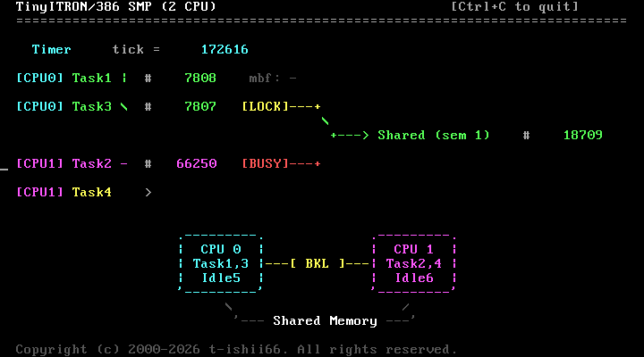

# システム全体の動き — tiny-itron デモの解説

本ドキュメントは、tiny-itron の起動から定常動作までの全体像を解説する。
6 つのタスクが 2 つの CPU でどのように動作し、ITRON API・排他制御・
割り込みを通じてどう連携しているかを、コードに即して説明する。

---

## 目次

1. [タスク構成の全体像](#1-タスク構成の全体像)
2. [起動シーケンス](#2-起動シーケンス)
3. [Task 1 (first_task) の動作](#3-task-1-first_task-の動作)
4. [Task 3 (usr_main) の動作](#4-task-3-usr_main-の動作)
5. [Task 2 (second_task) の動作](#5-task-2-second_task-の動作)
6. [Task 4 (kbd_task) の動作](#6-task-4-kbd_task-の動作)
7. [Task 5・6 (idle_task) の役割](#7-task-56-idle_task-の役割)
8. [タスク間連携の全体図](#8-タスク間連携の全体図)
9. [スケジューラとタスク切り替え](#9-スケジューラとタスク切り替え)
10. [排他制御: Big Kernel Lock](#10-排他制御-big-kernel-lock)
11. [割り込みの流れ](#11-割り込みの流れ)
12. [VGA 画面レイアウト](#12-vga-画面レイアウト)
13. [タイムライン: 定常動作の 1 サイクル](#13-タイムライン-定常動作の-1-サイクル)
14. [Ctrl-C によるシステム停止](#14-ctrl-c-によるシステム停止)

---

## 1. タスク構成の全体像

```
┌─────────────────────────────────┬─────────────────────────────────┐
│           CPU 0                 │           CPU 1                 │
├─────────────────────────────────┼─────────────────────────────────┤
│  Task 1 (first_task)            │  Task 2 (second_task)           │
│    優先度 15、カウントアップ    │    優先度 15、カウントアップ    │
│    MBF 受信、Task 3 と交互動作  │    セマフォ競合 (pol_sem)       │
│                                 │                                 │
│  Task 3 (usr_main)              │  Task 4 (kbd_task)              │
│    優先度 15、セマフォ競合      │    優先度 1 (最高)              │
│    Task 1 と交互動作            │    キーボード入力処理           │
│                                 │    → MBF でTask 1 に行送信     │
│                                 │                                 │
│  Task 5 (idle_task)             │  Task 6 (idle_task)             │
│    優先度 16 (最低)、pause ループ│    優先度 16 (最低)、pause ループ│
└─────────────────────────────────┴─────────────────────────────────┘
```

| タスク ID | 関数 | CPU | 優先度 | 生成元 |
|-----------|------|-----|--------|--------|
| 1 | `first_task` | 0 | 15 | `proc_init` (起動時) |
| 2 | `second_task` | 1 | 15 | `proc_init` (起動時) |
| 3 | `usr_main` | 0 | 15 | Task 1 が `cre_tsk` + `act_tsk` |
| 4 | `kbd_task` | 1 | 1 | Task 2 が `cre_tsk` + `act_tsk` |
| 5 | `idle_task` | 0 | 16 | `proc_init` (起動時) |
| 6 | `idle_task` | 1 | 16 | `proc_init` (起動時) |

---

## 2. 起動シーケンス

電源投入から全タスクが動き始めるまでの流れ:

```
  CPU 0 (BSP)                              CPU 1 (AP)
  ─────────                                ─────────
  start.s: リアルモード→プロテクトモード
  run.s: cpu_num=0 → main()
  │
  ├─ all_init()
  │   ├─ idt_init()       IDT 設定
  │   ├─ video_init()     VGA 初期化
  │   ├─ i8259_init()     PIC 初期化
  │   ├─ timer_init()     PIT 初期化
  │   └─ key_init()       キーボード初期化
  │
  ├─ page_init()           ページテーブル構築 (全恒等マッピング + CPU スタック保護)
  ├─ page_enable()         CR3 ロード + CR0.PG=1 でページング有効化
  │
  ├─ itron_init()
  │   ├─ tsk_init()       tsk[] を TTS_NON に初期化
  │   ├─ sem_init()       sem[] 初期化
  │   ├─ dtq_init()       dtq[] 初期化
  │   ├─ sched_init()     優先度キュー初期化
  │   └─ pool_init()      メモリプール初期化
  │
  ├─ proc_init()                CPU 0 上で全タスクのデータ構造を準備
  │   ├─ Task 1 生成 (affinity=CPU0, TTS_RUN)
  │   ├─ Task 2 生成 (affinity=CPU1, TTS_RUN)
  │   ├─ Task 5 生成 (affinity=CPU0, idle)
  │   └─ Task 6 生成 (affinity=CPU1, idle)
  │   ※ ここでは cre_tsk + act_tsk + TTS_RUN 設定のみ。
  │     実際の実行は start_first_task / start_second_task で開始される。
  │
  ├─ tss_init()           TSS 設定 (両 CPU 分)
  │
  ├─ smp_init()
  │   ├─ Local APIC 有効化
  │   ├─ APIC タイマー設定
  │   ├─ INIT IPI → SIPI を AP に送信 ─────→  AP 起動
  │   │                                        │
  │   ├─ while(!cpu_second) 待機                ├─ start.s: 再実行
  │   │                                  ←─── ├─ run.s: cpu_num=1 → main()
  │   │                                        │
  │   │                                        ├─ page_enable()
  │   │                                        │   CR3 ロード (BSP と同じページテーブル)
  │   │                                        └─ smp_ap_init()
  │   │                                            ├─ TSS ロード
  │   │                                            ├─ APIC 有効化
  │   │                                            ├─ APIC タイマー設定
  │   │                                            ├─ cpu_second = 1
  │   │         cpu_second=1 確認 ←───────────────┤
  │   │                                            └─ start_second_task()
  │   ├─ timer_start()    PIT IRQ0 有効化                   │
  │   ├─ key_start()      IRQ1 有効化                       │
  │   └─ start_first_task()                                 │
  │           │                                             │
  │     ltr SEL_TSS0                                  ltr SEL_TSS1
  │     ESP=kern_esp → ret                            ESP=kern_esp → ret
  │     → RESTORE_ALL → iret                          → RESTORE_ALL → iret
  │     → Ring 3 に遷移                               → Ring 3 に遷移
  │           │                                             │
  ▼           ▼                                             ▼
Task 1 (first_task) 開始                        Task 2 (second_task) 開始
```

重要なポイント:

- **初期化順序**: `itron_init()` → `proc_init()` の順序が必須。
  逆にすると `tsk_init()` が `proc_init()` で設定した状態を消してしまう。
- **統一されたタスク起動**: 初回タスク起動も `ltr` + `RESTORE_ALL` + `iret` で行う。
  `ljmp` によるハードウェア TSS スイッチは使わない。
- **Ring 遷移**: カーネルは Ring 0 で動作するが、ユーザータスクは Ring 3。
  `proc_create` が構築した偽フレームの EFLAGS に IF=1 が含まれ、`iret` で割り込みが有効になる。
- **ページング**: BSP が `page_init()` でページテーブルを構築し、`page_enable()` で
  CR0.PG=1 にする。AP は BSP と同じページテーブルを `page_enable()` でロードする。
  全ページは恒等マッピング (仮想アドレス = 物理アドレス) で、U/S ビットにより
  カーネルコード・データ、CPU スタック領域 (0x750000〜)、VGA バッファ (0xB8000) を
  Supervisor 保護する。ユーザーコード (.user_text) とユーザーデータ (.user_data) のみ
  User ページとしてマッピングされる (詳細は `memory-map.md` 参照)。

---

## 3. Task 1 (first_task) の動作

**ファイル**: `kernel/user.c:141`
**CPU**: 0、**優先度**: 15

Task 1 は起動直後にシステムの共有オブジェクトを生成し、
その後 Task 3 と交互にカウントアップするタスクである。

### 初期化フェーズ

```c
/* 1. バイナリセマフォ生成 (ID=1, count=1) */
csem.sematr  = TA_TFIFO;
csem.isemcnt = 1;
csem.maxsem  = 1;
cre_sem(1, &csem);

/* 2. メッセージバッファ生成 (ID=1, maxmsz=64, mbfsz=256) */
cmbf.mbfatr = TA_TFIFO;
cmbf.maxmsz = 64;         /* 1メッセージ最大 64 バイト */
cmbf.mbfsz  = 256;        /* リングバッファ 256 バイト */
cmbf.mbf    = (VP)0;      /* カーネルがバッファ確保 */
cre_mbf(1, &cmbf);

/* 3. Task 3 生成・起動 */
ctsk.task    = (FP)usr_main;
ctsk.stk     = tsk_stack_alloc(1024);  /* スタック確保 (syscall) */
ctsk.itskpri = TMAX_TPRI - 1;     /* 優先度 15 */
cre_tsk(3, &ctsk);
act_tsk(3);

/* 4. VGA 画面ヘッダ描画 (clear_screen/print_at syscall 経由) */
draw_header();
```

セマフォ・メッセージバッファ・Task 3 の生成はすべて Task 1 が行う。
Task 2 はセマフォも MBF も生成しない — Task 1 が先に生成してくれる前提。

`draw_header()` は `clear_screen()` と `print_at()` syscall を使って VGA 画面に
ヘッダ・固定ラベルを描画する。Ring 3 から VGA バッファ (0xB8000) への直接アクセスは
ページ保護 (Supervisor) により禁止されているため、すべて syscall 経由で行う。

`shared_count` と `task_count[]` は `.user_data` セクションに配置されている (User ページ)。
Ring 3 のユーザータスクから直接読み書きできる。

### メインループ

```c
while (1) {
    task_count[1]++;                                       /* カウントアップ */
    print_dec_at(ROW_TASK1, 19, task_count[1], 8, ...);   /* 画面表示 (syscall) */

    /* MBF 1 からキーボードの行文字列をタイムアウト付き受信 */
    mbf_ret = trcv_mbf(1, mbf_buf, 20);   /* 20 tick ≈ 0.33s */
    if ((int)mbf_ret > 0) {
        /* 受信成功: mbf_ret はメッセージサイズ (バイト数) */
        int len = (int)mbf_ret;
        if (len > 80 - 36)
            len = 80 - 36;                /* 表示エリア (44 文字) に切り詰め */
        mbf_buf[len] = '\0';
        print_at(ROW_TASK1, 36, mbf_buf, ATTR_YELLOW);  /* syscall */
        /* 残りの表示エリアをクリア */
        if (36 + len < 80)
            fill_at(ROW_TASK1, 36 + len, 80 - 36 - len, ' ', ATTR_YELLOW);
    }

    wup_tsk(3);       /* Task 3 を起こす → Task 3 が RDY に */
    slp_tsk();        /* 自分は WAI に → Task 3 に CPU を譲る */
}
```

1 サイクルで行うこと:
1. `task_count[1]` をインクリメントし画面に表示
2. MBF 1 から行文字列をタイムアウト付き受信 (`trcv_mbf`)。
   行が来れば即座に受信、来なければ 20 tick 後にタイムアウト (E_TMOUT) で復帰。
   タイムアウトがペーシングの役割を果たすため `delay()` は不要
3. `wup_tsk(3)` で Task 3 を起床させ、`slp_tsk()` で自分は眠る

---

## 4. Task 3 (usr_main) の動作

**ファイル**: `kernel/user.c:215`
**CPU**: 0、**優先度**: 15

Task 3 は Task 1 が生成するタスクで、**セマフォを使って CPU 間の
共有カウンタ (`shared_count`) にアクセスするデモ** を担当する。

### 状態マシン (3 フェーズ)

Task 3 はセマフォの取得・保持・休止の 3 フェーズを循環する:

```
  ┌──────────┐   pol_sem(1)==E_OK   ┌──────────┐
  │   REST   │ ───────────────────→ │   LOCK   │
  │ (休止中) │                      │ (保持中) │
  │ phase_cnt│                      │ phase_cnt│
  │  < 40    │  ←───────────────── │  >= 20   │
  └──────────┘    sig_sem(1)        └──────────┘
       │
       │ pol_sem(1)==E_TMOUT
       ▼
  画面に "BUSY" 表示
  (他 CPU がロック中)
```

### メインループの詳細

```c
while (1) {
    task_count[3]++;

    if (have_sem) {
        /* LOCK フェーズ: セマフォ保持中 */
        shared_count++;         /* 共有カウンタをインクリメント */
        phase_cnt++;
        if (phase_cnt >= SEM_HOLD) {   /* 20 回保持したら解放 */
            sig_sem(1);
            have_sem = 0;
            phase_cnt = 0;
        }
    } else if (phase_cnt < SEM_REST) {
        /* REST フェーズ: セマフォに触らない (40 回スキップ) */
        phase_cnt++;
    } else {
        /* TRY フェーズ: セマフォ取得を試みる */
        if (pol_sem(1) == E_OK) {      /* 非ブロッキング取得 */
            have_sem = 1;
            shared_count++;
        } else {
            /* BUSY: Task 2 (CPU 1) がロック中 */
        }
    }

    delay();
    wup_tsk(1);    /* Task 1 を起こす */
    slp_tsk();     /* 自分は眠る */
}
```

**Task 1 との交互動作パターン**:

```
  Task 1                Task 3
  ──────                ──────
  実行中                WAI (眠っている)
    │
  wup_tsk(3) ──→       RDY に遷移
  slp_tsk()             │
  WAI に遷移  ←── 実行開始
                        │
                      処理 (セマフォ等)
                        │
                      wup_tsk(1) ──→ Task 1 が RDY に
                      slp_tsk()
                      WAI に遷移  ←── Task 1 実行開始
```

同一 CPU (CPU 0) 上で 2 つのタスクがピンポンのように交互に動く。

---

## 5. Task 2 (second_task) の動作

**ファイル**: `kernel/user.c:279`
**CPU**: 1、**優先度**: 15

Task 2 は CPU 1 で動作し、Task 3 と **CPU をまたいでセマフォを競合**
するタスクである。

### 初期化フェーズ

```c
/* Task 4 (キーボード) を生成 */
ctsk.task    = (FP)kbd_task;
ctsk.stk     = tsk_stack_alloc(1024);  /* スタック確保 (syscall) */
ctsk.itskpri = 1;                  /* 最高優先度 */
cre_tsk(4, &ctsk);
act_tsk(4);
```

Task 4 は CPU 1 で生成されるため、CPU アフィニティは 1 を継承する。
優先度 1 (最高) なので、Task 4 が RDY になると Task 2 はプリエンプトされる。

### メインループ

Task 2 のセマフォ処理は Task 3 とほぼ同一のロジックだが、
**`slp_tsk` / `wup_tsk` を使わず、無限ループで回り続ける** 点が異なる:

```c
while (1) {
    task_count[2]++;

    /* Task 3 と同じ LOCK/REST/TRY の 3 フェーズ */
    if (have_sem) {
        shared_count++;
        if (phase_cnt >= SEM_HOLD)
            sig_sem(1);
    } else if (phase_cnt < SEM_REST) {
        phase_cnt++;
    } else {
        if (pol_sem(1) == E_OK) { ... }
    }

    delay();
    /* ← slp_tsk() がない。ずっと回り続ける */
}
```

Task 2 が `slp_tsk` しない理由: CPU 1 では Task 2 が唯一の「常時動作する」
タスクである。眠ると起こしてくれる相手がいない (Task 4 はキー入力時のみ動く)。

### CPU 間のセマフォ競合

Task 2 (CPU 1) と Task 3 (CPU 0) が同時に `pol_sem(1)` を呼ぶと:

```
  CPU 0 (Task 3)              CPU 1 (Task 2)
  ──────────────              ──────────────
  pol_sem(1)                  pol_sem(1)
    │                           │
  int $0x99                   int $0x99
    │                           │
  c_intr_syscall              c_intr_syscall
    ├─ kernel_lk 取得 ✓ ──┐     ├─ kernel_lk 取得 → スピン待ち
    │  sys_pol_sem          │     │  │
    │  semcnt=1, 取得成功   │     │  │
    │  semcnt=0             │     │  │
    ├─ kernel_lk 解放 ─────┘     │  │
    │                       ←───┘  │
    │                           ├─ kernel_lk 取得 ✓
    │                           │  sys_pol_sem
    │                           │  semcnt=0, E_TMOUT
    │                           ├─ kernel_lk 解放
    ▼                           ▼
  LOCK 表示                   BUSY 表示
```

`kernel_lk` (BKL) が CPU 間のアトミック性を保証する。
`c_intr_syscall` で `kernel_lk` を取得してから `itron_syscall` を呼ぶため、
2 つの CPU が同時にセマフォカウンタをデクリメントすることはない。

---

## 6. Task 4 (kbd_task) の動作

**ファイル**: `kernel/user.c:365`
**CPU**: 1、**優先度**: 1 (最高)

Task 4 はキーボード入力を処理する **イベント駆動型タスク** である。
起動時に `set_key_task(2)` syscall でキーボードドライバに DTQ ID (= 2) を登録する
(ISR が `ipsnd_dtq` でどの DTQ に文字を送るかを知るため)。
普段は `rcv_dtq(2, &data)` で DTQ 2 をブロッキング受信しており、
キーが押されると ISR が DTQ 2 に文字を送信し、Task 4 が起床する。
受信した文字はローカルバッファ (`line_buf[64]`) に蓄積し、Enter キーまたは
行末到達で `psnd_mbf(1, line_buf, line_pos)` により MBF 1 経由で
Task 1 に行文字列を送信する。Backspace にも対応する。
画面表示は `print_at()` syscall、行クリアは `fill_at()` syscall で行う。
VGA バッファへの直接書き込み (0xB8000) は Supervisor ページ保護により不可能である。

### 動作フロー

```
                   CPU 0                          CPU 1
                   ─────                          ─────
                                            Task 4: rcv_dtq(2) でブロック中 (TTS_WAI)
  キーが押される
        │
  IRQ1 → PIC → CPU 0 に配送
        │
  key_intr() (ISR)
    ├─ スキャンコード読み取り
    ├─ ASCII 変換
    └─ ipsnd_dtq(0, 2, ch)
         │  (kernel_lk は c_intr_irq1 で取得済み)
         ├─ DTQ 2 に文字を格納
         ├─ Task 4 が DTQ 2 で待機中 → 起床
         │    tsk[4].tskstat = TTS_RDY
         │    sched_ins(1, &tsk[4].plink)
         └─ sched_next_tsk(0)
              next_tsk_flag[0] = 1
              next_tsk_flag[1] = 1  ──→  CPU 1 にも通知
                                          │
                                    次の APIC タイマー割り込み
                                          │
                                    intr_leave → sched_next_tsk_check(1)
                                          │
                                    sched_do_next_tsk(1)
                                      Task 4 (優先度 1) > Task 2 (優先度 15)
                                      → Task 4 に切り替え
                                          │
                                    Task 4 実行
                                      ├─ rcv_dtq(2) が文字を返す
                                      ├─ line_buf にバッファリング
                                      ├─ print_at() でエコー表示 (syscall)
                                      ├─ Enter or 行末: psnd_mbf(1, buf, len)
                                      │    MBF 1 経由で Task 1 に行送信
                                      └─ rcv_dtq(2) で再びブロック (TTS_WAI)
                                          │
                                    Task 2 に復帰
```

### プリエンプションの仕組み

Task 4 は優先度 1、Task 2 は優先度 15 である。
Task 4 が RDY になると、`sched_do_next_tsk` が優先度キューを上から探索し、
Task 4 を見つけて切り替える。

```c
/* sched.c: sched_do_next_tsk */
for (i = 1; i <= TMAX_TPRI; i++) {
    /* 優先度 1 から探索 → Task 4 が先に見つかる */
    if (t->tskstat == TTS_RDY && proc[t->tskid].cpu == apic)
        /* Task 4 に切り替え */
}
```

Task 2 は一時的に TTS_RDY に変更され、Task 4 が `rcv_dtq(2)` で再びブロック (TTS_WAI) すると
再び Task 2 が選択されて復帰する。

### MBF による行文字列の転送

Task 4 は蓄積した行文字列を **メッセージバッファ 1** 経由で Task 1 に送る:

```
  Task 4 (CPU 1)                       MBF 1                 Task 1 (CPU 0)
  ──────────────                  (256B リングバッファ)         ──────────────
  psnd_mbf(1, "hello", 5) ──→  [5|hello]  ──→  trcv_mbf(1, buf, 20)
                                                 → 戻り値 5, buf="hello"
```

`psnd_mbf` は非ブロッキング送信。バッファが満杯なら `E_TMOUT` を返す。
`trcv_mbf` はタイムアウト付きブロッキング受信。メッセージが来れば
メッセージサイズ (正の値) を返し、20 tick 以内に来なければ `E_TMOUT` を返す。

---

## 7. Task 5・6 (idle_task) の役割

**ファイル**: `kernel/user.c:354`
**CPU**: 0 (Task 5)・1 (Task 6)、**優先度**: 16 (最低)

```c
void idle_task(void)
{
    while (1)
        __asm__ volatile("pause");
}
```

idle_task は CPU を空転させるだけのタスクで、他に動かせるタスクがない
ときの「受け皿」である。

### なぜ必要か

スケジューラ (`sched_do_next_tsk`) は優先度キューから RDY タスクを探す。
CPU 上の全タスクが WAI 状態の場合、RDY タスクが見つからず、
現在のタスクをそのまま実行し続けてしまう (WAI なのに実行される「ゴースト」問題)。

idle_task は常に RDY で優先度最低なので:
- 他のタスクが RDY なら、そちらが優先される
- 全タスクが WAI なら、idle_task が選ばれて安全に空転する

---

## 8. タスク間連携の全体図

```
         CPU 0                                        CPU 1
  ┌───────────────────┐                        ┌───────────────────┐
  │ Task 1  (pri 15)  │◄──── MBF 1 ──────────│ Task 4  (pri  1)  │
  │     ↕ slp/wup     │   (行文字列送信)       │   rcv_dtq(2)      │
  │ Task 3  (pri 15)  │                        │ Task 2  (pri 15)  │
  │ Task 5  (idle)    │                        │ Task 6  (idle)    │
  └───────────────────┘                        └───────────────────┘

  Task 3 ─ pol/sig_sem(1) ─┐            ┌─ pol/sig_sem(1) ─ Task 2
                            ▼            ▼
                       ┌─────────────────┐
                       │      sem 1      │
                       │  shared_count   │
                       └─────────────────┘

  IRQ1 (PIC → CPU 0): key_intr() ── ipsnd_dtq(2) ──→ DTQ 2 → Task 4 起床
  Task 4 (pri 1) は DTQ 受信で起床し Task 2 (pri 15) をプリエンプト
```

### 連携メカニズムのまとめ

| メカニズム | 使用箇所 | 説明 |
|-----------|---------|------|
| `slp_tsk` / `wup_tsk` | Task 1 ↔ Task 3 | 同一 CPU で交互実行 |
| `ipsnd_dtq` / `rcv_dtq` | ISR → DTQ 2 → Task 4 | キー割り込みで DTQ 経由タスク起床 |
| `pol_sem` / `sig_sem` | Task 2 vs Task 3 | CPU 間の排他制御 |
| `psnd_mbf` / `trcv_mbf` | Task 4 → MBF 1 → Task 1 | CPU 間の行文字列送受信 |
| プリエンプション | Task 4 が Task 2 を横取り | 優先度による割り込み |

---

## 9. スケジューラとタスク切り替え

### タスク切り替えが起こるタイミング

このカーネルには **タイマーによる強制プリエンプション** はない。
切り替えは以下の 2 つの契機で起こる:

1. **syscall 契機**: `slp_tsk()` や `wup_tsk()` の中で `sched_next_tsk()` が呼ばれる
2. **割り込み復帰時**: `intr_leave` が `next_tsk_flag` を確認し、`sched_do_next_tsk()` を呼ぶ

### sched_next_tsk — リスケジューリング要求

```c
/* sched.c */
ID sched_next_tsk(W apic)
{
    next_tsk_flag[0] = 1;   /* 両 CPU にフラグをセット */
    next_tsk_flag[1] = 1;
    return E_OK;
}
```

この関数はフラグをセットするだけで、実際の切り替えはしない。
切り替えは割り込みからの `intr_leave` 時に行われる。

### intr_leave → sched_next_tsk_check → sched_do_next_tsk

```
  割り込みハンドラ (C 関数から戻った後)
    │
    jmp intr_return
    │
    call intr_leave
    │
    ├─ k_nest デクリメント
    ├─ k_nest == 0 ? (最外殻の割り込みからの復帰か?)
    │   ├─ YES:
    │   │   ├─ current_proc[cpu]->kern_esp = ESP  (現タスクの ESP 保存)
    │   │   ├─ sched_next_tsk_check(apic)
    │   │   │         │
    │   │   │         ├─ next_tsk_flag[apic] != 0 ?
    │   │   │         │   ├─ YES: sched_do_next_tsk(apic)
    │   │   │         │   │         優先度キューを探索
    │   │   │         │   │         current_proc[apic] を更新
    │   │   │         │   └─ NO: 何もしない
    │   │   │         └─ next_tsk_flag[apic] = 0
    │   │   ├─ ESP = current_proc[cpu]->kern_esp  (新タスクの ESP ロード)
    │   │   └─ tss_update_esp0(cpu, kern_stack_top)  (TSS.esp0 更新)
    │   └─ NO: ネストした割り込みなので何もしない
    │
    RESTORE_ALL  (9 レジスタを pop: ES, DS, EDI, ESI, EBP, EBX, EDX, ECX, EAX)
    iret         (EIP, CS, EFLAGS, ESP, SS を pop → Ring 3 に復帰)
```

### sched_do_next_tsk — タスク選択アルゴリズム

```c
/* sched.c */
ID sched_do_next_tsk(W apic)
{
    smp_lock(&kernel_lk);

    /* 1. 現在のタスクを RDY に戻す (プリエンプション対応) */
    old_id = c_tskid[apic];
    if (tsk[old_id].tskstat == TTS_RUN) {
        tsk[old_id].tskstat = TTS_RDY;
        was_run = 1;
    }

    /* 2. 優先度 1 (最高) から 16 (最低) まで順に探索 */
    for (i = 1; i <= TMAX_TPRI; i++) {
        /* この優先度の RDY タスクで、この CPU のものを探す */
        if (t->tskstat == TTS_RDY && proc[t->tskid].cpu == apic) {
            t->tskstat = TTS_RUN;
            current_proc[apic] = &proc[t->tskid];
            smp_unlock(&kernel_lk);
            return t->tskid;
        }
    }

    /* 3. 見つからなければ元のタスクを復帰 */
    if (was_run)
        tsk[old_id].tskstat = TTS_RUN;
    smp_unlock(&kernel_lk);
}
```

CPU アフィニティフィルタ (`proc[t->tskid].cpu == apic`) により、
各 CPU は自分に割り当てられたタスクだけを選択する。

---

## 10. 排他制御: Big Kernel Lock

SMP 環境では 2 つの CPU が同時にカーネルデータを触る。
tiny-itron は **Big Kernel Lock (BKL)** — 単一のスピンロック `kernel_lk` で
全カーネルデータ構造を保護する。

### なぜ BKL か

すべての割り込みハンドラが割り込みゲート (GT_INTR) 経由で呼ばれるため、
ハンドラ進入時に CPU が IF を自動クリアする。
同一 CPU 上では割り込みが禁止されている間は競合しないので、
ロックの役割は **CPU 間の排他のみ** である。

BKL であればロック境界の誤りは **原理的に起きない**。
2 CPU・教育用カーネルでは細粒度ロックの性能メリットより、
正しさの保証のほうが重要である。

### ロック取得の 5 箇所

`kernel_lk` の取得/解放はカーネルの入口でのみ行う。
各 syscall 関数やタイマー処理の内部では「caller holds kernel_lk」を前提とし、
ロック操作は行わない。

| 取得箇所 | ファイル | 保護範囲 |
|---------|---------|---------|
| `c_intr_syscall` | i386/syscall.c | `itron_syscall` 全体 (全 syscall) |
| `c_intr_irq0` | i386/interrupt.c | `timer_intr(0,1)` + PIC EOI |
| `c_intr_irq1` | i386/interrupt.c | `key_intr()` + PIC EOI |
| `c_intr_smp_timer1` | i386/interrupt.c | `timer_intr(1,1)` + APIC EOI |
| `sched_do_next_tsk` | kernel/sched.c | 関数全体 (`intr_leave` 経由で呼ばれる) |

`sched_do_next_tsk` だけが自身でロックを取得・解放する。
他の 4 箇所はカーネルに入った直後に取得し、戻る直前に解放する。

### video_lk が別な理由

`printk` は syscall (`sys_printf`) と ISR の両方から呼ばれる。
ISR は `kernel_lk` を保持して呼ばれるため、`printk` 内で `kernel_lk` を
取ると **同一 CPU でデッドロック** する。
そのため VGA 出力の保護には別のロック変数 `video_lk` を使う。

### IF=0 との関係

割り込みゲート (GT_INTR) で IF=0 になるため、同一 CPU 上では
カーネルコード実行中に割り込みが入らない。
したがって BKL は **2 CPU 間の排他のみ** を担当する。

```
  CPU 0                           CPU 1
  ─────                           ─────
  int $0x99 → IF=0                APIC タイマー → IF=0
  smp_lock(&kernel_lk) ✓          smp_lock(&kernel_lk) → スピン待ち
  itron_syscall(...)               │
    sys_slp_tsk(...)              │ (CPU 0 が解放するまでスピン)
  smp_unlock(&kernel_lk)          │
                              ←─ ロック取得 ✓
                                  timer_intr(1,1)
                                  smp_unlock(&kernel_lk)
```

### コード例: sys_pol_sem (BKL 版)

`kernel_lk` は `c_intr_syscall` で取得済みなので、
syscall 関数の内部にはロック操作がない:

```c
/* sys_sem.c: sys_pol_sem */
ER sys_pol_sem(W apic, ID semid)
{
    /* caller holds kernel_lk */
    if (semid < 1 || semid > MAX_SEMID)
        return E_ID;
    if (sem[semid].semcnt == 0)
        return E_TMOUT;         /* 資源なし */
    sem[semid].semcnt--;        /* 資源獲得 */
    return E_OK;
}
```

CPU 間の排他は外側の `kernel_lk` が保証しているため、
2 つの CPU が同時に `semcnt` を読み書きすることはない。

### sched_do_next_tsk の疑似コード

`sched_do_next_tsk` は `intr_leave` から呼ばれるため、
syscall パスとは異なり自身でロックを取得する:

```c
ID sched_do_next_tsk(W apic)
{
    smp_lock(&kernel_lk);

    /* 現在のタスクを RDY に戻す (プリエンプション対応) */
    if (tsk[old_id].tskstat == TTS_RUN)
        tsk[old_id].tskstat = TTS_RDY;

    /* 優先度 1 (最高) → 16 (最低) で RDY タスクを探索 */
    for (i = 1; i <= TMAX_TPRI; i++) {
        if (t->tskstat == TTS_RDY && proc[t->tskid].cpu == apic) {
            t->tskstat = TTS_RUN;
            current_proc[apic] = &proc[t->tskid];
            smp_unlock(&kernel_lk);
            return t->tskid;
        }
    }

    /* RDY タスクなし → 元のタスクを復帰 */
    smp_unlock(&kernel_lk);
    return E_ID;
}
```

`tskstat` の変更がすべてロック内で行われるため、
2 つの CPU が同時にタスク状態を変更する競合が防止される。

### スピンロックの実装

```c
/* smp.c */
void smp_lock(unsigned long *p)
{
    while (cxchg(p, 1))           /* xchgl 命令でアトミックに交換 */
        __asm__ volatile("pause"); /* スピン中は pause で省電力 */
}

void smp_unlock(unsigned long *p)
{
    cxchg(p, 0);
}
```

`xchgl` は x86 のアトミック命令で、メモリとレジスタの値を不可分に交換する。
`cli`/`sti` を使わないため、**Ring 3 (ユーザーモード) からも呼び出せる**。
これが `cpu_lock`/`cpu_unlock` (cli/sti ベース、Ring 0 限定) との違い。

---

## 11. 割り込みの流れ

### 割り込みソースと配送先

| 割り込みソース | ベクタ | 配送先 | ハンドラ |
|---------------|--------|--------|---------|
| PIT (タイマー) | IRQ0 (0x80) | CPU 0 のみ | `c_intr_irq0` → `timer_intr(0, 1)` |
| キーボード | IRQ1 (0x81) | CPU 0 のみ | `c_intr_irq1` → `key_intr()` |
| APIC タイマー 0 | 0x9A | CPU 0 | `c_intr_smp_timer0` → EOI のみ |
| APIC タイマー 1 | 0x9B | CPU 1 | `c_intr_smp_timer1` → EOI のみ |
| syscall | 0x99 | 呼び出し元 CPU | `c_intr_syscall` → `itron_syscall` |

PIC (i8259) 経由の IRQ は CPU 0 にのみ配送される。
CPU 1 はタイマーとして APIC タイマーだけを使う。

### キーボード割り込みの全フロー

```
1. キー押下
     ↓
2. IRQ1 → PIC → CPU 0 に配送 (CPU 1 には行かない)
     ↓
3. intr.s: intr_irq1
     ├─ SAVE_ALL             レジスタ退避 (pt_regs 構築)
     ├─ call intr_enter      k_nest0++
     ├─ call c_intr_irq1
     │   └─ key_intr()
     │       ├─ inb(IO_KEY)      スキャンコード読み取り
     │       ├─ Ctrl+C チェック → 該当なら CPU リセット (後述)
     │       ├─ ASCII 変換
     │       └─ ipsnd_dtq(0, key_dtq_id, ch)
     │            │  key_dtq_id = 2 (kbd_task が set_key_task(2) で登録)
     │            │  (kernel_lk は c_intr_irq1 で取得済み)
     │            ├─ DTQ 2 に文字を格納
     │            ├─ Task 4 が rcv_dtq(2) で待機中 → 起床
     │            │    tsk[4].tskstat = TTS_RDY
     │            │    sched_ins(1, &tsk[4].plink)
     │            └─ sched_next_tsk(0)
     │                 next_tsk_flag[0] = 1
     │                 next_tsk_flag[1] = 1
     │
     ├─ jmp intr_return
     │   ├─ intr_leave
     │   │   └─ sched_next_tsk_check(0)
     │   │       (CPU 0 には Task 4 がないので切り替えなし)
     │   ├─ RESTORE_ALL
     │   └─ iret

     --- 一方 CPU 1 では ---

4. APIC タイマー割り込み (定期的に発生)
     ↓
5. intr.s: intr_smp_timer1
     ├─ SAVE_ALL
     ├─ call intr_enter      k_nest1++
     ├─ call c_intr_smp_timer1
     │   └─ smp_eoi()         # EOI のみ (タイムアウト処理なし)
     ├─ jmp intr_return
     │   ├─ intr_leave
     │   │   ├─ sched_next_tsk_check(1)
     │   │   │   ├─ next_tsk_flag[1] == 1 → sched_do_next_tsk(1)
     │   │   │   ├─ Task 4 (優先度 1, cpu=1, RDY) を発見
     │   │   │   └─ current_proc[1] = &proc[4]
     │   │   ├─ ESP = proc[4].kern_esp (Task 4 のカーネルスタック)
     │   │   └─ tss_update_esp0(1, proc[4].kern_stack_top)
     │   ├─ RESTORE_ALL (Task 4 のレジスタを pop)
     │   └─ iret → Task 4 のコンテキストで復帰
```

### APIC タイマーの役割

CPU 0 の APIC タイマーは EOI を送るだけ (`c_intr_smp_timer0`)。
PIT (IRQ0) がタイマーティックを処理する。

CPU 1 の APIC タイマーも EOI のみ (`c_intr_smp_timer1`)。
タイムアウトキューの delta 減算は CPU 0 の PIT だけが行い、APIC タイマーは
プリエンプティブなタスクスイッチの契機 (`intr_leave` → `sched_next_tsk_check`)
を提供する。CPU 1 でタスクスイッチが起きるのはこの APIC タイマー割り込みの
帰り道である。

---

## 12. VGA 画面レイアウト

定常動作中の画面 ([LOCK] 表示タイミングのスクリーンショット):



```
  Row:
   0:  TinyITRON/386 SMP (2 CPU)                      [Ctrl+C to quit]
   1:  ======================================================================...
   2:
   3:    Timer      tick =    172616
   4:
   5:  [CPU0] Task1 | #    7806   mbf: -
   6:
   7:  [CPU0] Task3 \ #    7807   [LOCK]---+
   8:                                       \
   9:                            +---> Shared (sem 1)   #    18709
  10:                                      /
  11:  [CPU1] Task2 - #   66250   [BUSY]---+
  12:
  13:  [CPU1] Task4   >
  14:
  15:
  16:                      .---------.             .---------.
  17:                      |  CPU 0  |             |  CPU 1  |
  18:                      | Task1,3 |---[ BKL ]---| Task2,4 |
  19:                      |  Idle5  |             |  Idle6  |
  20:                      '---------'             '---------'
  21:                            \                     /
  22:                             '--- Shared Memory --'
  23:
  24:  Copyright (c) 2000-2026 t-ishii66. All rights reserved.
```

| 行 | 内容 | 更新元 |
|----|------|--------|
| 0 | ヘッダ | Task 1 (`draw_header`) |
| 1 | セパレータ | Task 1 (`draw_header`) |
| 3 | PIT タイマーティック | `timer_intr` (ISR、Ring 0 から直接 VGA 書き込み) |
| 5 | Task 1 のカウント + MBF 受信文字列 | Task 1 |
| 7 | Task 3 のカウント + セマフォ状態 | Task 3 |
| 8 | 対角矢印 `\` (Task 3 がセマフォ保持中のみ表示) | Task 3 |
| 9 | `shared_count` の値 (緑=Task3, マゼンタ=Task2) | Task 2 or Task 3 |
| 10 | 対角矢印 `/` (Task 2 がセマフォ保持中のみ表示) | Task 2 |
| 11 | Task 2 のカウント + セマフォ状態 | Task 2 |
| 13 | Task 4 のキーボードエコー | Task 4 |
| 16-22 | SMP アーキテクチャ図 (静的) | Task 1 (`draw_header`) |
| 24 | Copyright (静的) | Task 1 (`draw_header`) |

セマフォ表示 (行 7, 11):
- `[LOCK]---+` (黄色) + 対角矢印 (緑/マゼンタ): セマフォ獲得中、`shared_count` 増加中
- `[BUSY]---+` (赤): `pol_sem` が `E_TMOUT` (他 CPU がロック中)
- 空白: 休止中 (セマフォに触らないフェーズ)

`+---> Shared (sem 1)` と `shared_count` の色:
- **緑** = Task 3 (CPU 0) が最後に更新
- **マゼンタ** = Task 2 (CPU 1) が最後に更新
- **暗い灰色** = どちらもセマフォ未保持

**VGA アクセスと syscall**: VGA テキストバッファ (0xB8000) は Supervisor ページとして
マッピングされているため、Ring 3 のユーザータスクから直接アクセスすると #PF (ページフォルト)
が発生する。すべての画面書き込みは `print_at()`、`print_dec_at()`、`fill_at()`、
`clear_screen()` の各 syscall (lib/lib_exd.c で定義) を経由してカーネル内で実行される。
タイマーティック (行 3) のみ ISR (Ring 0) から直接 VGA に書き込む。

---

## 13. タイムライン: 定常動作の 1 サイクル

CPU 0 と CPU 1 が並行して動作する様子:

```
時間 →

CPU 0:
  ┌─ Task 1 ─┐  ┌─ Task 3 ─┐  ┌─ Task 1 ─┐  ┌─ Task 3 ─┐
  │ count++   │  │ count++   │  │ count++   │  │ count++   │
  │ trcv_mbf  │  │ pol_sem   │  │ trcv_mbf  │  │ pol_sem   │
  │ delay()   │  │ delay()   │  │ delay()   │  │ delay()   │
  │ wup_tsk(3)│  │ wup_tsk(1)│  │ wup_tsk(3)│  │ wup_tsk(1)│
  │ slp_tsk() │  │ slp_tsk() │  │ slp_tsk() │  │ slp_tsk() │
  └───────────┘  └───────────┘  └───────────┘  └───────────┘

CPU 1:
  ┌──────────── Task 2 ─────────────────────────────────────────┐
  │ count++  delay()  count++  delay()  count++  delay()  ...   │
  │ pol_sem           pol_sem           pol_sem                 │
  └──────────────────────────────┬──────┬────────────────────────┘
                                 │      │
                           ┌─ Task 4 ─┐
                           │ rcv_dtq(2)│  ← キー割り込み時のみ
                           │ echo+buf  │
                           │ Enter:    │
                           │ psnd_mbf  │
                           │ rcv_dtq(2)│
                           └───────────┘
                                 │
                   ←─── Task 2 に復帰 ───→

  タイマー割り込み:
  ↑   ↑   ↑   ↑   ↑   ↑   ↑   ↑   ↑   ↑
  PIT (CPU0)         APIC (CPU1)
```

- CPU 0 では Task 1 と Task 3 が `slp_tsk`/`wup_tsk` で規則正しく交互に動く
- CPU 1 では Task 2 がほぼ独占的に動き、キー入力時だけ Task 4 がプリエンプトする
- セマフォの競合は非同期に発生する (Task 2 は常時ループ、Task 3 は交互動作)
- 画面の `shared_count` の色が緑とマゼンタで切り替わることで、
  CPU 間のセマフォ競合が視覚的に確認できる

---

## 14. Ctrl-C によるシステム停止

### 概要

ユーザーが **Ctrl-C** を押すと、システムは安全に停止する。
QEMU の `-no-reboot` オプションと組み合わせることで、VM がクリーンに終了する。

### 動作フロー

```
  キーボードで Ctrl を押下
    │
  IRQ1 → key_intr()
    ├─ scancode 0x1d → mode |= CTRL
    └─ return (文字キーではないのでバッファに入れない)

  次にキーボードで C を押下
    │
  IRQ1 → key_intr()
    ├─ scancode 0x2e, mode & CTRL == true
    ├─ cli                          割り込み禁止
    ├─ vga_write_at(12, 28,         画面中央に
    │    "  System halted.  ",      メッセージ表示
    │    0x4F)                      (白文字・赤背景)
    ├─ outb(0x64, 0xFE)             キーボードコントローラ経由で
    │                               CPU リセットラインをパルス
    └─ while(1) { hlt; }            リセット失敗時のフォールバック
```

### キーボードコントローラによる CPU リセット

```c
/* keyboard.c: Ctrl+C ハンドラ */
if ((mode & CTRL) && c == 0x2e) {
    __asm__("cli");
    vga_write_at(12, 28, "  System halted.  ", 0x4F);
    outb(IO_KEY_CS, 0xFE);     /* ポート 0x64 に 0xFE を送信 */
    while (1) { __asm__("hlt"); }
}
```

i8042 キーボードコントローラのポート 0x64 にコマンド 0xFE を書き込むと、
コントローラが CPU のリセットラインをパルスする。これは IBM PC/AT 互換機の
標準的な再起動方法である。

### QEMU での動作

QEMU は `-no-reboot` オプション付きで起動している (`run.sh`)。
CPU リセットが発生すると、QEMU は再起動せずに **VM を停止 (shutdown)** する。

- curses モード (`./run.sh`): ターミナルに制御が戻る
- GTK モード (`./run.sh -g`): ウィンドウが閉じる
- nographic モード (`./run.sh -n`): プロセスが終了する

これにより、ユーザーは Ctrl-C で QEMU セッションを自然に終了できる。

Ctrl-C の処理は `key_intr()` 内で `cli` → VGA 表示 → CPU リセットと進むため、
他の割り込みに邪魔されることなく確実に停止できる。
